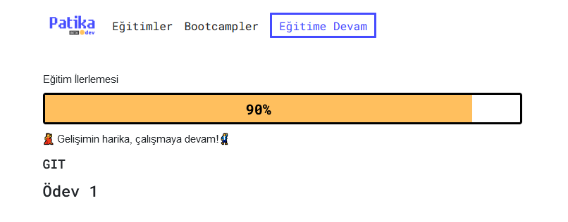

# Kodluyoruz İlk Repo
Bu repo Kodluyoruz Back-End Eğitiminde oluşturduğumuz ilk repo. İçerisinde bir adet README dosyası barındırıyor.



## Installation
<hr>
Öncelikle projeyi clonelayın. (Buraya sizin reponuzdan aldığınız link gelecek)

`git clone https://github.com/cengizcmataraci/kodluyoruzilkrepo.git`

## Usage
<hr>
Projeyi cloneladıktan sonra Visual Studio Code programında açınız.

Linux için:

```
cd kodluyoruzilkrepo
code .
```

## Contributing
<hr>
Pull requestler kabul edilir. Büyük değişiklikler için, lütfen önce neyi değiştirmek istediğinizi tartışmak için bir konu açınız.

## License
<hr>
[MIT](https://opensource.org/licenses/MIT)

